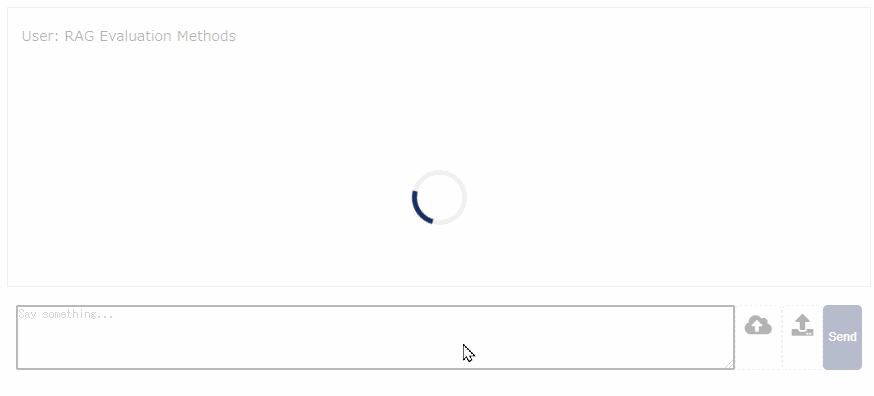
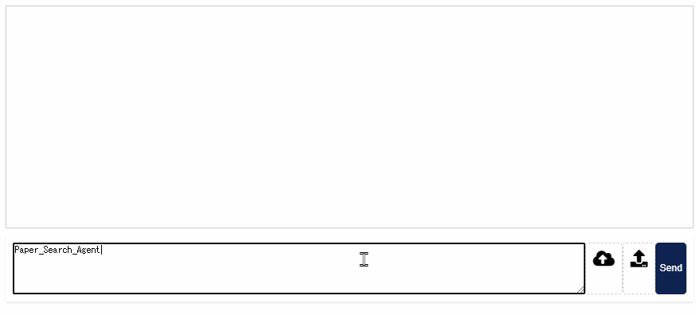
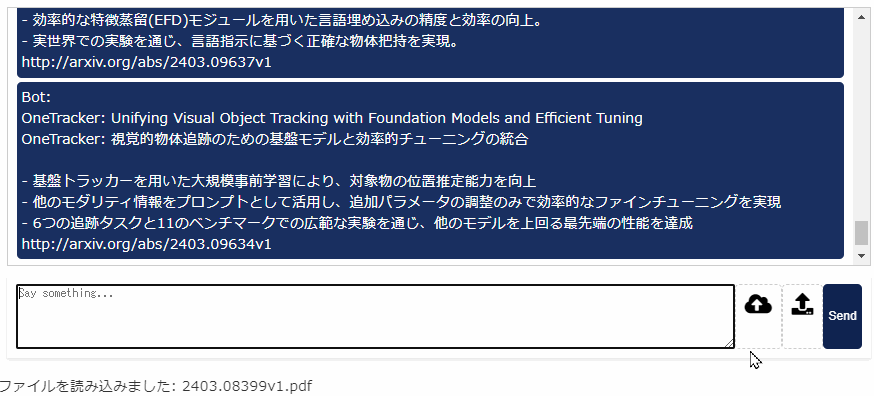

# Flaskフレームワークを用いた論文調査レビュー

1. 入力した内容に関連する論文を検索
2. 読み込んだPDFファイルの概要、使用アルゴリズムの説明、疑似コードによる実行の流れの表示

## 入力した内容に関連する論文を検索

## 読み込んだPDFファイルの概要表示

   

## Reference

- [System for systematic literature review using multiple AI agents: Concept and an empirical evaluation](https://arxiv.org/abs/2403.08399)